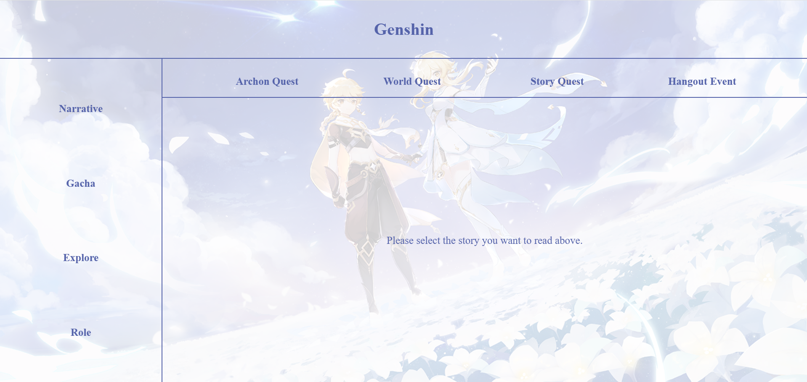
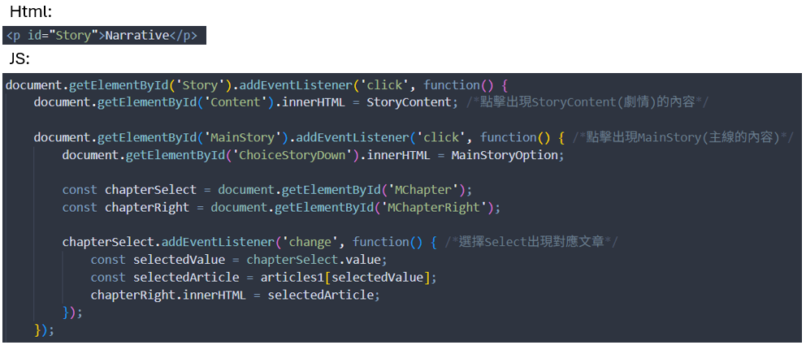
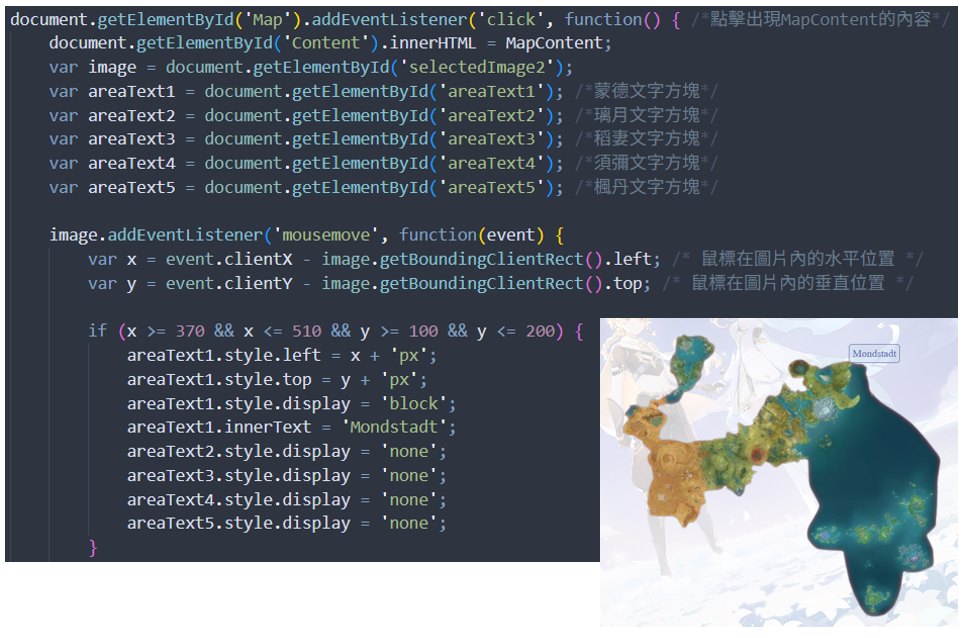
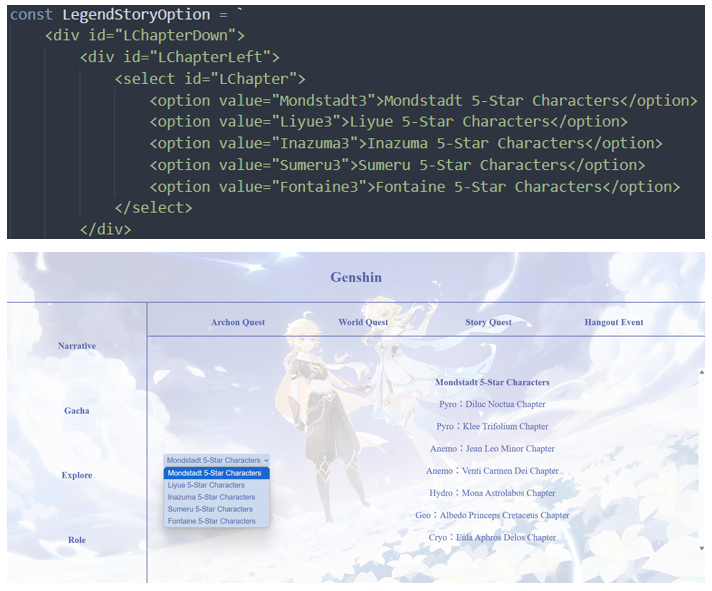

# My HTML Web Project
A static website made with pure HTML, CSS and JavaScript, showing the game introduction and play information of “Genshin Impact”, suitable for front-end practice projects.
## Preview Screen

## Built With
- HTML5
  - **Layout Divisions**(#Container, #Title, #Menu, #Content)
  - **DOM Manipulation**(id="Story"-->getElementById())
    
- CSS3
  - **Responsive Layout with Flexbox**(lex-direction, justify-content, and align-items.)
  - **Component Styling**(border-radius)
  - **Tooltip Design**(position: absolute)
  - **Scroll and Overflow Handling**(overflow-y, max-height)
  - **Background and Imagery**(::before)
  - **Typography and Color Scheme**(used centered alignment)
- JavaScript
  - **DOM Manipulation**(getElementById, addEventListener, innerHTML, style.display, style.top/left)
  - **Event Handling**(click, change, mousemove, mouseover / mouseout)
    
  - **Dropdown & Dynamic Image Display**
    
  - **Conditional Display**
  - **Navigation**(window.location.href)
## Key Features
- Genshin Impact themed character showcase site
- Clean and structured layout using Flexbox
- Built with pure HTML/CSS, no external frameworks
- Fully static and lightweight
## Project Motivation
I am particularly interested in user interface and front-end visual design. Through this project, I explored fundamental UI principles such as color coordination, font selection, and layout structure.
Although this is a lightweight project, it serves as a complete and representative example in my portfolio, demonstrating my understanding of the web development process and structural logic.
